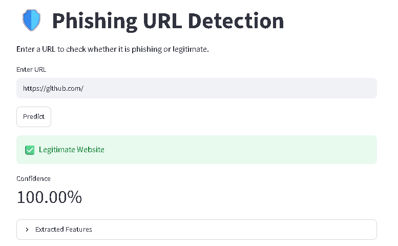
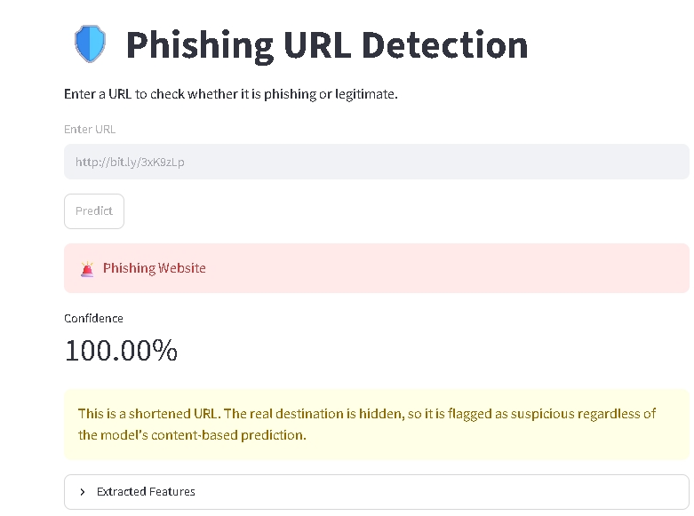

# 🛡️ Phishing URL Detection System

<p align="center">


</p>

---

# 📌 Overview

The **Phishing URL Detection System** is an end-to-end Machine Learning application that analyzes a website URL and predicts whether it is **Legitimate** or **Phishing**, using a trained Scikit-learn pipeline combined with real-time URL and webpage feature extraction.

This project demonstrates the complete machine learning lifecycle, including:

- Data Collection
- Data Cleaning
- Exploratory Data Analysis (EDA)
- Feature Engineering (URL-based and HTML-based)
- Categorical Encoding
- Feature Scaling
- Model Training
- Model Evaluation
- Rule-Based Safety Overrides
- Model Deployment

The final **Decision Tree Pipeline** was trained on the **PhiUSIIL Phishing URL Dataset** and is served through an interactive Streamlit web application, enhanced with rule-based overrides for edge cases such as URL shorteners and unreachable domains.

---

# 🚀 Live Demo

### 🌐 Streamlit Application

**https://phishing-url-detection-edph9ksuqm4rceyyj98up4.streamlit.app/**

---

# 💻 GitHub Repository

**https://github.com/ARAGALAGOVARDHANREDDY/phishing-url-detection**

---

# 🎯 Problem Statement

Phishing websites attempt to steal sensitive information such as usernames, passwords, banking credentials, and personal data by impersonating legitimate websites. Manually verifying every suspicious link is slow and error-prone.

The objective of this project is to build a machine learning system that automatically analyzes a URL — along with the live webpage it points to — and predicts whether it is safe or malicious, helping users identify phishing attempts in real time.

---

# ✨ Key Features

- 🔍 Real-time phishing URL detection
- 🤖 Machine Learning–based prediction (Decision Tree Pipeline)
- ⚡ Fast, on-demand analysis
- 📊 Automated feature extraction from both the URL and live webpage content
- 🧮 Confidence score for every prediction
- 🔗 Special handling for shortened URLs (bit.ly, tinyurl.com, etc.)
- 🌐 Fallback handling for unreachable/offline domains
- 🧹 Automatic missing value handling
- 📦 End-to-end deployment-ready pipeline
- 🔄 Reusable, modular prediction pipeline

---

# 📂 Dataset

**Source:** PhiUSIIL Phishing URL Dataset

The dataset contains thousands of phishing and legitimate URLs, along with engineered numerical and categorical features describing URL structure and webpage content.

## Target Column

```
label

0 → Legitimate
1 → Phishing
```

---

# ⚙️ Machine Learning Workflow

```
User URL
   │
   ▼
Feature Extraction (URL + Live Webpage)
   │
   ▼
Data Cleaning
   │
   ▼
Missing Value Imputation
   │
   ▼
Feature Scaling & Encoding
   │
   ▼
Decision Tree Pipeline
   │
   ▼
Rule-Based Safety Overrides
   │
   ▼
Final Prediction
```

---

# 🧠 Feature Extraction Details

Features are extracted from two sources:

### URL-Based Features
- URL Length / Domain Length
- IP Address Detection
- TLD & TLD Legitimacy Probability
- Subdomain Count
- Obfuscation & Special Character Ratios
- Letter / Digit Ratios
- HTTPS Usage

### Webpage-Based Features (fetched live)
- Title & Domain Match Score
- Favicon, Meta Description, Responsiveness
- Form Analysis (external form submission, password fields, hidden fields)
- Resource Counts (Images, CSS, JavaScript, iFrames)
- Keyword Detection (Bank, Payment, Crypto)
- Redirect Count

### Rule-Based Safety Overrides
Since a machine learning model can only judge what it can actually observe, two safeguards sit on top of the raw prediction:

| Scenario | Behavior |
|---|---|
| **Shortened URL** (bit.ly, tinyurl.com, etc.) | Flagged as suspicious — the real destination is hidden, so a "Legitimate" verdict cannot be trusted. |
| **Unreachable / Offline Domain** | Flagged as suspicious — if the live page can't be fetched, content-based features default to empty and could otherwise be misread as a clean, minimal legitimate page. |

---

# 🤖 Machine Learning Model

| Component | Details |
|---|---|
| **Algorithm** | Decision Tree Classifier |
| **Pipeline** | Scikit-learn `ColumnTransformer` + `Pipeline` |
| **Preprocessing** | Missing value imputation, feature scaling, one-hot encoding |
| **Serialization** | Joblib |

---

# 📊 Model Performance

| Metric | Score |
|---|---:|
| Accuracy | 100% |
| Precision | 100% |
| Recall | 100% |
| F1 Score | 100% |
| ROC-AUC | 100% |

> **Note:** These results reflect evaluation on the selected dataset and train/test split used during training. Real-world phishing detection performance can vary since live webpage content changes over time.

---

# 🌐 Web Application

The trained model is deployed as an interactive Streamlit application where users can:

- Enter any website URL
- Trigger real-time feature extraction and prediction
- View the predicted label (Legitimate / Phishing)
- View the model's confidence score
- Inspect all extracted features used in the decision
- See a warning message when a rule-based override is applied

---

# 📸 Application Screenshots

## 🔮 Prediction — Legitimate URL



---

## 🔮 Prediction — Phishing URL



---

# 📁 Project Structure

```
phishing-url-detection/
│
├── app.py
├── streamlit_app.py
├── predictor.py
├── feature_extractor.py
├── utils.py
├── requirements.txt
├── runtime.txt
├── README.md
├── .gitignore
│
├── models/
│   ├── phishing_decision_tree_pipeline.pkl
│   └── feature_names.json
│
├── assets/
│   └── images/
│       ├── prediction1.png
│       └── prediction2.png
│
├── notebooks/
│   └── EDA.ipynb
│
└── dataset/
```

---

# 🚀 Installation

Clone the repository

```bash
git clone https://github.com/ARAGALAGOVARDHANREDDY/phishing-url-detection.git
```

Move into the project directory

```bash
cd phishing-url-detection
```

Create a virtual environment

Windows

```bash
python -m venv venv
venv\Scripts\activate
```

Linux/Mac

```bash
python -m venv venv
source venv/bin/activate
```

Install dependencies

```bash
pip install -r requirements.txt
```

Run the application

```bash
streamlit run app.py
```

---

# 🛠️ Technologies Used

## Programming

- Python

## Machine Learning

- Scikit-learn
- Pandas
- NumPy

## Web Scraping & Parsing

- Requests
- BeautifulSoup
- lxml
- tldextract

## Model Serialization

- Joblib

## Web Framework

- Streamlit

## Deployment

- Streamlit Community Cloud

## Version Control

- Git
- GitHub

---

# 📈 Future Improvements

- Deep Learning models
- Explainable AI (SHAP / LIME)
- Real-time browser extension
- Batch URL prediction
- REST API deployment
- Docker containerization
- CI/CD using GitHub Actions
- Cloud deployment (AWS / Azure / GCP)
- URL reputation & threat intelligence feed integration

---

# 🤝 Contributing

Contributions are welcome.

1. Fork the repository
2. Create a feature branch
3. Commit your changes
4. Push your branch
5. Open a Pull Request

---

# 👨‍💻 Author

**Aragala Govardhan Reddy**

🔗 GitHub: https://github.com/ARAGALAGOVARDHANREDDY

---

# ⭐ Support

If you found this project useful, please consider giving it a ⭐ on GitHub.

It helps others discover the project and supports future improvements.

---

## 📄 License

This project is licensed under the MIT License.
